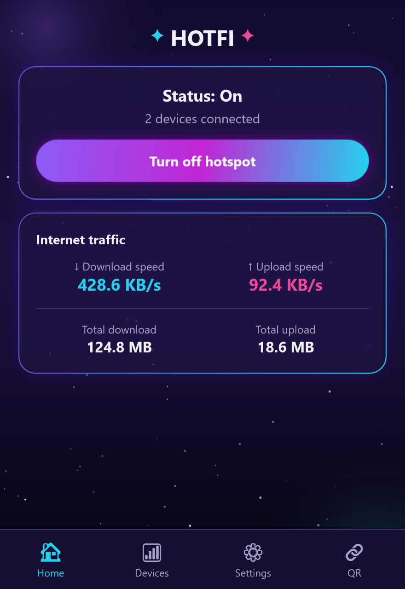
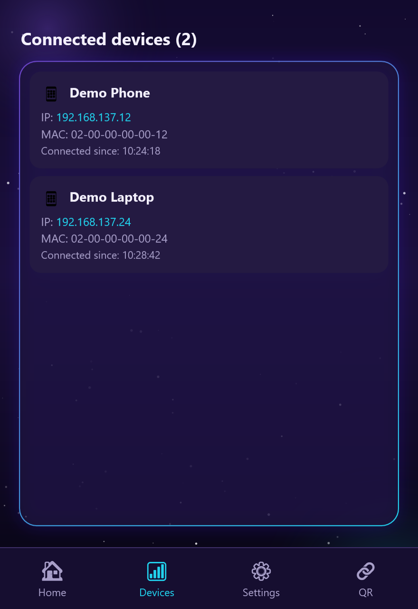
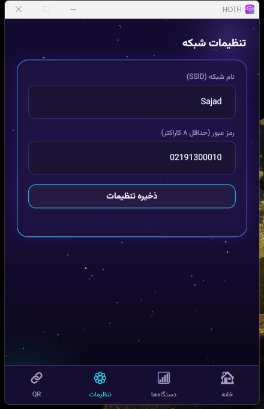

<div dir="rtl" align="right">

# HOTFI

اپلیکیشن دسکتاپ ویندوزی برای مدیریت هات‌اسپات: روشن و خاموش کردن یک‌کلیکی، تنظیم نام و رمز شبکه، اتصال آنی با اسکن کد QR، و نمایش زنده‌ی دستگاه‌های متصل و میزان ترافیک مصرفی.

## امکانات

- ⚡ روشن و خاموش کردن هات‌اسپات با یک کلیک
- 🔐 تنظیم نام شبکه و رمز عبور
- 📱 لیست دستگاه‌های متصل به همراه نام، آدرس‌های شبکه و زمان اتصال
- 📊 نمایش سرعت لحظه‌ای و مجموع دیتای آپلود و دانلود مصرفی
- 🔗 اتصال خودکار با اسکن کد QR، بدون نیاز به وارد کردن دستی رمز
- 🎨 طراحی کهکشانی با گرادیان‌های نئونی و پشتیبانی کامل از راست‌به‌چپ
- 📦 نصب تک‌فایلی و خودکار، با ساخت خودکار شورتکات دسکتاپ و منوی استارت

## تصاویر

| خانه | دستگاه‌های متصل |
|---|---|
|  |  |

| تنظیمات | اتصال با QR |
|---|---|
|  |  |

## نصب

۱. آخرین نسخه‌ی `HOTFI-Setup.exe` را از بخش [Releases](../../releases) دانلود کنید.
۲. آن را اجرا کنید — برنامه به‌صورت خودکار در مسیر کاربری شما نصب شده و شورتکات دسکتاپ و منوی استارت می‌سازد.
۳. از طریق شورتکات HOTFI اجرا کنید.

</div>

## Build from source

```bash
dotnet publish -c Release -r win-x64 --self-contained true \
  -p:PublishSingleFile=true \
  -p:IncludeNativeLibrariesForSelfExtract=true \
  -p:EnableCompressionInSingleFile=true \
  -o publish
```

## Tech stack

- .NET 8 / WPF
- Windows.Networking.NetworkOperators (Mobile Hotspot API)
- QRCoder
- Vazirmatn font

---

<div dir="rtl" align="right">

اگه این پروژه به دردتون خورد، یه ⭐ بدید!

</div>
